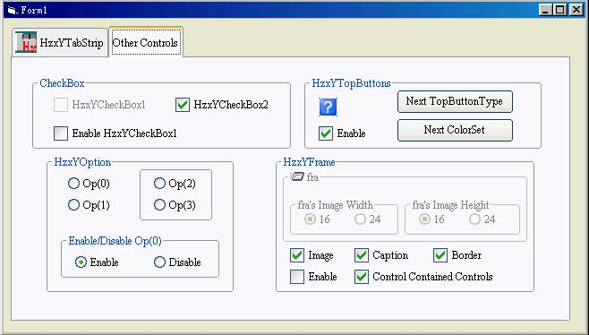



## HzxY Controls English Version

### Description

I was asked to put all my controls to a single ocx file. Enjoy it.
 
### More Info
 

             |
---                |---
**Submitted On**   |2003-01-04 15:12:56
**By**             |[Yin Huang](https://github.com/Planet-Source-Code/PSCIndex/blob/master/ByAuthor/yin-huang.md)
**Level**          |Beginner
**User Rating**    |5.0 (30 globes from 6 users)
**Compatibility**  |VB 6\.0
**Category**       |[Custom Controls/ Forms/  Menus](https://github.com/Planet-Source-Code/PSCIndex/blob/master/ByCategory/custom-controls-forms-menus__1-4.md)
**World**          |[Visual Basic](https://github.com/Planet-Source-Code/PSCIndex/blob/master/ByWorld/visual-basic.md)
**Archive File**   |[HzxY\_Contr152425152003\.zip](https://github.com/Planet-Source-Code/yin-huang-hzxy-controls-english-version__1-42190/archive/master.zip)

